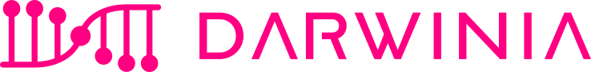

# [Darwinia](https://darwinia.network)

## Introduction

- **Cross-Chain Asset Relay Station**

  Darwinia Chain serves as a Polkadot Parachain that connects to Assethub and other assets through XCMP. Darwinia Chain collaborates deeply with [Helix Bridge](https://helixbridge.app) in a one-stop Bridge solution that can bridge various EVM ecosystems.

- **Omnichain Account**

  XAccount, standing for Cross-Chain Abstract Account, represents a pioneering approach to account abstraction at the cross-chain level. DApps on Darwinia will be able to interoperate with applications on other EVM chains through XAccount. The DApp for XAccount is coming soon.

- **EVM Chain secured by Polkadot**

  Darwinia Chain is parachain sharing the same level of security with Polkadot, and It is developed using [Polkadot-SDK](https://github.com/paritytech/polkadot-sdk) and fully compatible with EVM.

- **Comprehensive Cross-Chain Stack**

  [Msgport](https://msgport.ringdao.com) is a programmable Cross-Chain Messaging Port. Just as smart contracts provide programmability for DApp developers, integration with Msgport will empower developers on Darwinia Chain with the capability for cross-chain programming.

  To develop more interesting cross-chain DApps on Darwinia Chain using Msgport.

- [**RingDAO**](https://ringdao.com)

  RingDAO refers to the next governance version of Darwinia. RING serves as the governance token for RingDAO, and the upgrades to Darwinia Chain will be governed by RingDAO. RING also functions as the Gas Token for Darwinia Chain and plays a role in Collator Staking, among other aspects. RingDAO also governs other projects, including Msgport and XAPI. Learn more.

## Release

### Additional

There is a "stable" release channel, which will only be updated if the on-chain runtime upgrade is performed. The "stable" release channel is available at [darwinia-release](https://github.com/darwinia-network/darwinia-release).

Collators/Validators should focus on the latest [release](#release) channel.

RPC/Service suppliers should focus on the "stable" release channel.

## Documentation

- [Darwinia Home](https://darwinia.network)
- [Darwinia Docs](https://docs.darwinia.network)
- [Darwinia Improvement Proposals - DIPs](https://github.com/darwinia-network/DIPs)
- [Rust Reference Docs](#TODO)

## Contribution

Darwinia is open-source under the terms of the GPLv3, and we welcome contributions. Please review [CONTRIBUTIONS.md](doc/CONTRIBUTIONS.md) for more information.

## Security

The security policy and procedures can be found in [SECURITY.md](doc/SECURITY.md).
